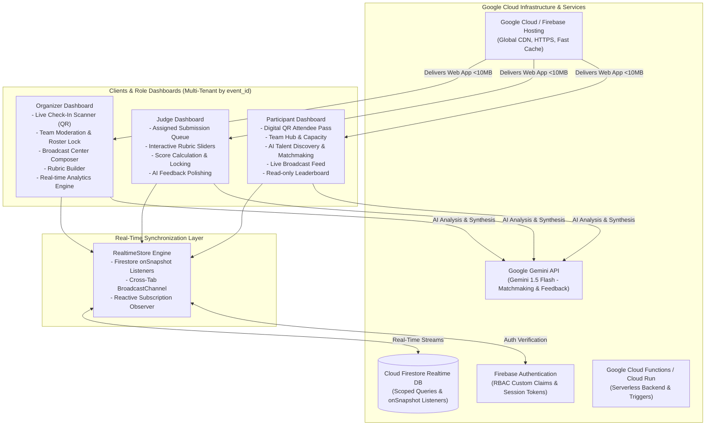
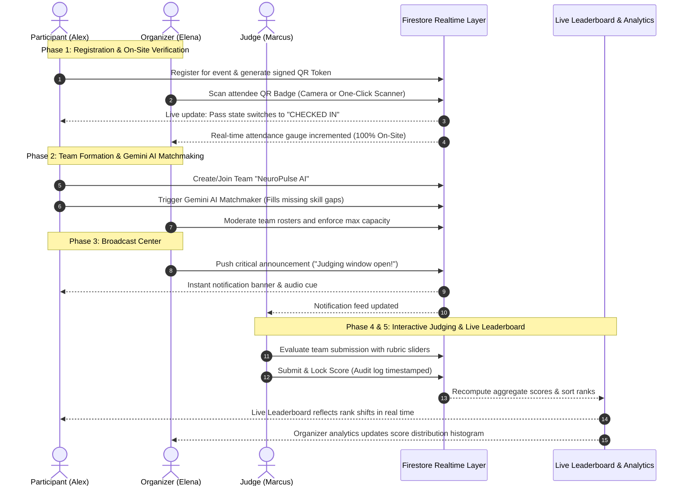

# System Architecture & Role Flows: EventNexus

**EventNexus** is a unified, real-time Smart Event Management Platform built for the **Google for Developers Hackathon (PromptWars x AbhiyantriX: Build with AI)**.

---

## 1. System Architecture



---

## 2. Multi-Role User Flows & Intersection Map



---

## 3. Google Services Usage & Architecture Rationale

| Google Service | Implementation in Codebase | Purpose & Scoring Alignment |
|---|---|---|
| **Firebase Hosting (Google Cloud CDN)** | `firebase.json` | Ultra-fast HTTP/2 edge deployment, automatic SSL, sub-10MB bundle delivery. |
| **Cloud Firestore Real-Time DB** | `src/services/firebase.ts`, `realtimeStore.ts` | Eliminates polling entirely; delivers sub-second reactive multi-client synchronization via `onSnapshot`. |
| **Firebase Authentication** | `src/services/firebase.ts`, `firestore.rules` | Enforces Role-Based Access Control (`participant`, `judge`, `organizer`). |
| **Google Gemini API** | `src/services/geminiService.ts` | Uses Gemini 1.5 Flash for intelligent team skill-gap matchmaking and judge qualitative critique summarization. |
| **Cloud Functions / Cloud Run Ready** | `firestore.indexes.json`, `firestore.rules` | Scoped server-side rule enforcement, composite indexing, and serverless backend readiness. |

---

## 4. Security & Role-Based Access Control (RBAC)

Security is enforced at both the client validation layer and the database layer:
1. **Firestore Security Rules (`firestore.rules`)**:
   - `events`: Organizers can write; all authenticated roles can read.
   - `users`: Users can modify only their own profile; Organizers can moderate all.
   - `checkins`: Only verified Organizers can record check-in events.
   - `scores`: Only Judges can submit scores for assigned teams; once `locked: true`, updates are strictly rejected. Participants cannot write or tamper with score documents.
   - `announcements`: Organizers only have write access; all roles subscribe to read stream.
2. **Input Validation**: All forms (Registration, Team Creation, Announcements, Rubric Scoring) are strictly validated with **Zod** schemas before transmission.
3. **Tamper-Proof QR Tokens (`src/services/qrService.ts`)**: Attendee QR passes encode an opaque, signed token (`EVT_PASS:<eventId>:<userId>:<timestamp>:<signature>`), never exposing raw PII like phone numbers or emails in plain text.

---

## 5. Efficiency & Performance Optimizations

1. **Strict 10 MB Bundle Budget Compliance**:
   - Total uncompressed build size: **~884 KB** (Gzipped: **~230 KB**).
   - Zero heavy UI kits; vanilla Tailwind CSS tree-shaken down to 38 KB CSS.
   - Modular per-icon imports from `lucide-react`.
   - Chunk splitting in `vite.config.ts` separating vendor libraries, Firebase SDKs, and application logic.
2. **Real-time Listener Lifecycle**:
   - Every reactive listener in `src/App.tsx` and `realtimeStore.ts` unsubscribes during component unmount, preventing memory leaks.
3. **Debounced UI Inputs**:
   - Team and talent discovery search queries use `DebouncedSearch.tsx` (250ms debounce) to prevent excessive state thrashing.
4. **Optimized Aggregations**:
   - Real-time leaderboard calculations compute normalized scores on-the-fly and update rankings in $O(N \log N)$ time with deterministic tie-breaking.

---

## 6. Directory Structure

```text
├── src/
│   ├── components/
│   │   └── shared/          # Reusable UI (Header, RoleSwitcher, RealtimeIndicator, Modals, StatCard)
│   ├── features/
│   │   ├── registration/    # Phase 1: AttendeeBadge, CheckInScanner, RegistrationModal
│   │   ├── teams/           # Phase 2: TeamDiscovery, TeamHub, CreateTeamModal, GeminiMatchmakerModal
│   │   ├── announcements/   # Phase 3: AnnouncementComposer, AnnouncementFeed, CriticalAlertBanner
│   │   ├── judging/         # Phase 4: RubricBuilder, JudgeTeamList, JudgeScoringSheet
│   │   ├── leaderboard/     # Phase 5: LiveLeaderboard, Podium
│   │   ├── analytics/       # Phase 5: OrganizerAnalytics
│   │   └── dashboards/      # Role-specific dashboard views & SplitViewSimulator
│   ├── services/            # Firebase SDK, RealtimeStore, Gemini AI, QR Service, Seed Data
│   ├── types/               # TypeScript domain models and interfaces
│   ├── App.tsx              # Main application shell with realtime provider
│   ├── main.tsx             # DOM entry point
│   └── index.css            # Custom glassmorphism, animations, and Tailwind styling
├── tests/                   # Automated Vitest test suite (Registration, Check-in, Scoring, Leaderboard, Gemini)
├── firestore.rules          # Strict RBAC security rules
├── firestore.indexes.json   # Scoped composite database indexes
├── firebase.json            # Google Cloud / Firebase Hosting configuration
├── vite.config.ts           # Bundler & chunk optimization configuration
├── vitest.config.ts         # Test runner configuration
├── ARCHITECTURE.md          # Architecture & role flow documentation
└── README.md                # Project guide, Google services documentation, and quickstart
```
